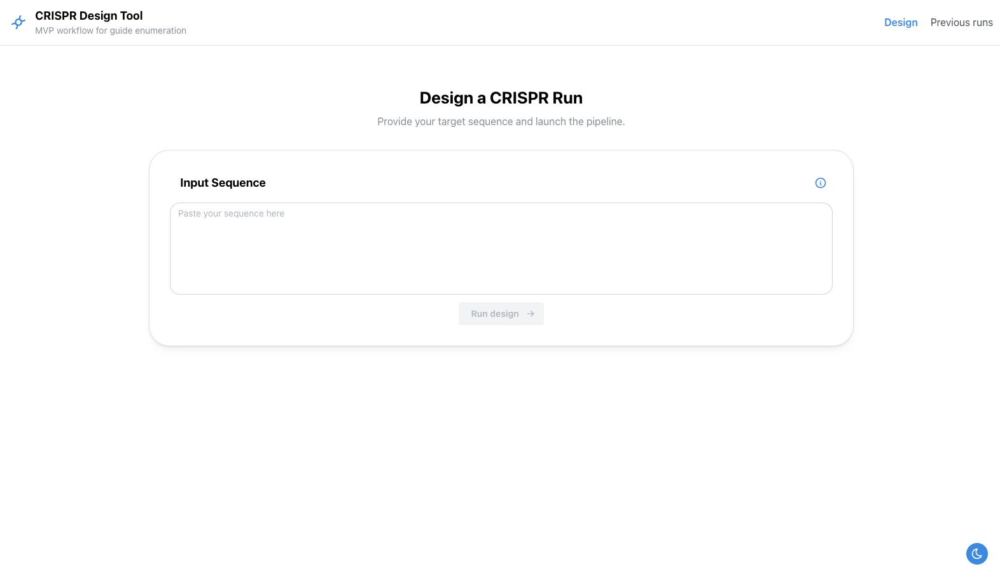
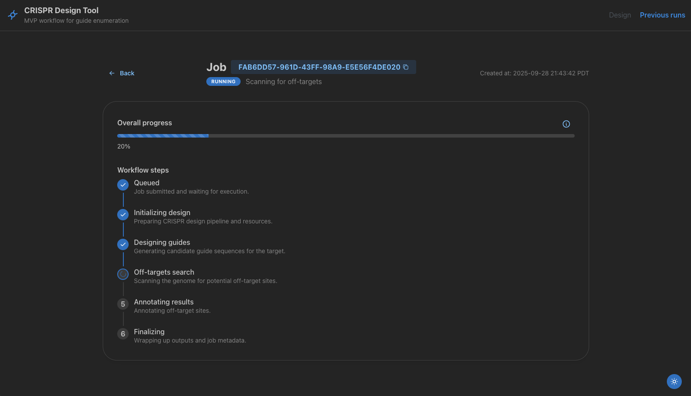
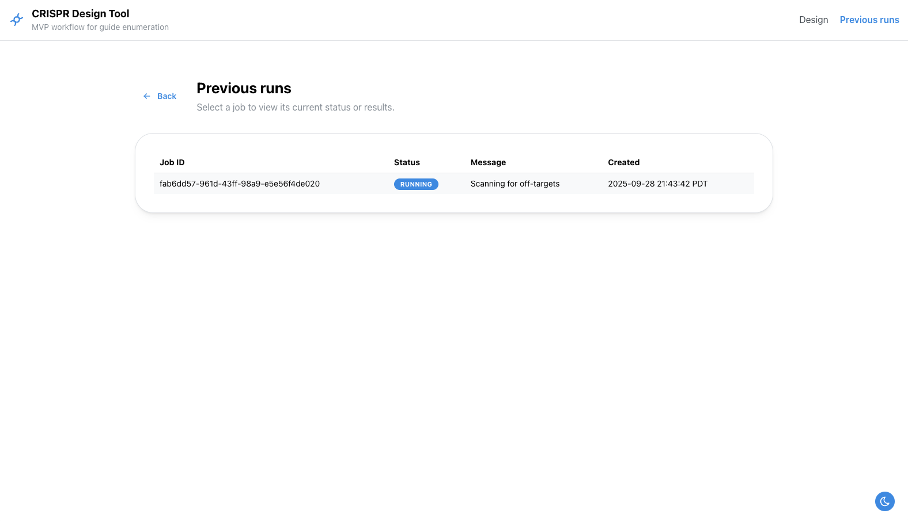
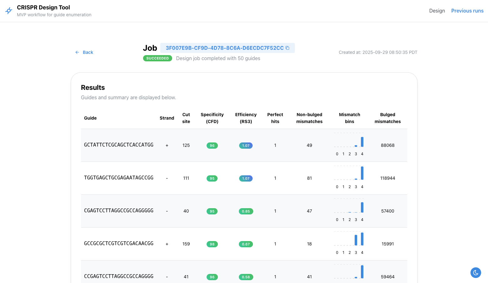

# 🧬 CRISPR Design Tool

A full-stack CRISPR design tool integrating [CRISPRitz](https://github.com/pinellolab/CRISPRitz), [RS3](https://github.com/gpp-rnd/rs3) and [CFD](https://pmc.ncbi.nlm.nih.gov/articles/PMC4744125/) into a scalable web platform with a **FastAPI backend**, **React frontend**, and **Celery task queue**.  
Deployed via Docker for reproducible runs. Built to manage CRISPR guide design jobs, off-target analysis, and scoring with a scalable, modular architecture.

---

## 🚀 Features

- **Single-click design**: Validate sequences, discover NGG protospacers, run off-target searches, and compute RS3 efficacy + CFD specificity scores.
    
- **Live progress tracking**: Redis-backed job management with caching so repeated inputs reuse existing results.
    
- **Interactive frontend**: Dashboards for monitoring job status, browsing past runs, and inspecting ranked guides.
    
- **Containerized deployment**: Backend API, Celery worker, Redis, and Vite frontend orchestrated with `docker compose`.
    

---

## 📸 Screenshots

1. **Landing Page** 


    
2. **Job progress** _(Dark mode)_



3. **Previous jobs**


    
4. **Results table** – guides with scores, mismatches, off-targets.



---

## 🏗️ Architecture

1. **Frontend (React + Vite)** → calls backend (`POST /api/design`), displays job status + results.
    
2. **Backend (FastAPI)** → validates input, records jobs in Redis, checks cache, enqueues Celery tasks.
    
3. **Celery Worker** → executes the design pipeline:
    
    - Candidate discovery (SpCas9 NGG).
        
    - Off-target search with CRISPRitz.
        
    - Scoring (CFD & RS3).
        
    - Results written to `/data/results/<job_id>`.
        
    - Progress streamed to Redis for UI updates.
        
4. **Redis** → powers caching, message queue, and job metadata.
    

> ⚠️ **Scope:** MVP supports _SpCas9 + NGG PAM on hg38_. More nucleases/genomes can be added with additional indices + scoring assets.

---

## 📂 Repository Layout

- `backend/` → FastAPI app, Celery tasks, scoring utilities.
    
- `frontend/` → React + TypeScript SPA using Mantine + TanStack Query.
    
- `data/` → Genome references, CRISPRitz indices, scoring pickles, job outputs.
    
- `docker-compose.yml` → Spins up backend, frontend, Redis, Celery worker.
    

---

## ⚙️ Setup

### Prerequisites

- Docker 24+ with Compose plugin.
    
- CRISPRitz genome indices + scoring assets (see below).
    

### Download hg38 reference & build index

```
cd data/genomes/hg38
wget https://hgdownload.soe.ucsc.edu/goldenPath/hg38/bigZips/hg38.chromFa.tar.gz
tar -xzf hg38.chromFa.tar.gz -C hg38
crispritz.py index-genome data/genomes/hg38/hg38 data/genomes/hg38 pam/pamNGG.txt -bMax 2 -th 4
```


### Configure environment

`cp .env.example .env`

Adjust paths for genome, PAM, and scoring assets. Example:

|Setting|Default|Notes|
|---|---|---|
|`HG38_REFERENCE_FASTA`|`/data/genomes/hg38/hg38`|Chromosome FASTAs|
|`CRISPRITZ_INDEX`|`/data/genomes/hg38/NGG_2_hg38`|Genome index|
|`MISMATCH_SCORES`|`/data/CFD_scoring_matrix/mismatch_score.pkl`|CFD scoring|
|`PAM_SCORES`|`/data/CFD_scoring_matrix/pam_scores.pkl`|CFD scoring|
|`CRISPRITZ_RESULTS_DIR`|`/data/results`|Output directory|

---

## ▶️ Run

Start the development stack with the helper script so the dev compose file is selected automatically:

`./manage.sh --env dev up -d --build`

- Frontend: [http://localhost:3000](http://localhost:3000)
    
- API docs: [http://localhost:5001/docs](http://localhost:5001/docs)
    

Shut everything down when you're done with:

`./manage.sh --env dev down`

---

## 🧪 Testing

Backend integration tests:

`RUN_INTEGRATION=1 PYTHONPATH=backend pytest backend/tests`

---

## 🔮 Roadmap

- Add support for more nucleases + PAMs.
    
- Persist results in Postgres for audit trails.
    
- **Genome viewer in the results page** for visualizing guide positions.
   
- Job status notifications via email
